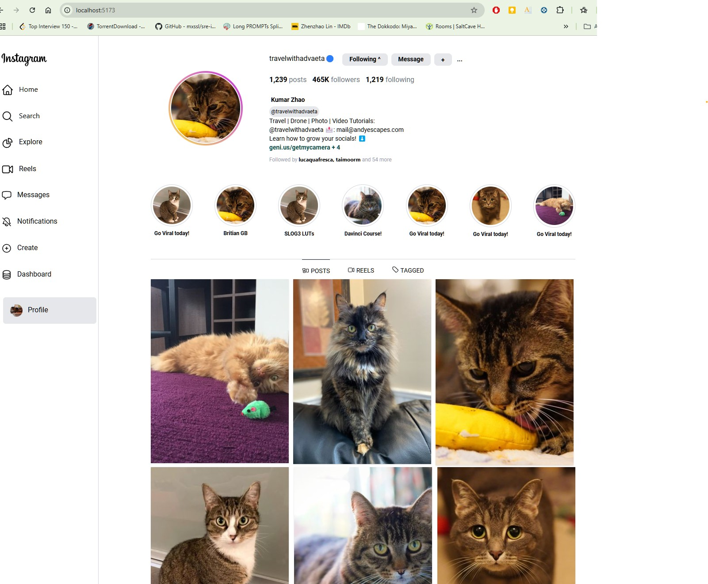

# About
Tailwindcss learning project: Clone of instagram profile page


# How-to


    $ npm run install

    $ npm run dev


# Key takeaways

- Use css variables
    
    ```
    :root {

      --nav-medium-width: 244px;
      --container-max-width: 960px;
    }
    ```

- Create max-width, nav-medium-width like variables to adjust container sizes

    
    ```
    .maxWidth {
      width: calc(100% - var(--nav-medium-width));
      max-width: min(100%,var(--container-max-width,960px));
    }
    ```
- Use classes to wrap duplicate properties inside one class
    
    ```
    .selected { 
      @apply border-gray-800 border-t-1;
    }
    ```


# Output


